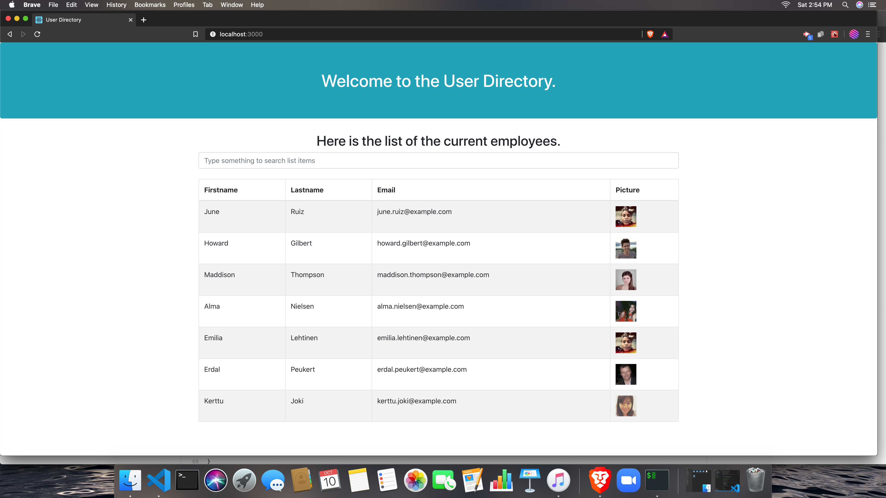

## Overview

In this application you can view a list of random users (named employees for this app) on the table. In addition to that, the table also contains email, and picture for each user.
The application is built using the React (Components), axios, and Node.js. 

The API is being retrieved from https://randomuser.me/api/.

### User Story
As a user, I want to be able to view my entire employee directory at once so that I have quick access to their information.

### Business Context
An employee or manager would benefit greatly from being able to view non-sensitive data about other employees. It would be particularly helpful to be able to filter employees by name.

### Deployed Link is below

https://rajesh2199.github.io/React-Employee-Directory/

### Application at glance.
